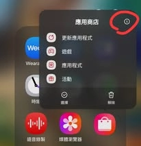
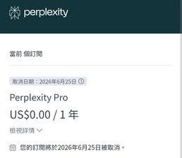

# 三星用户福利：Galaxy Store送Perplexity Pro一年会员

拿三星手机的朋友有福了。最近三星美区Galaxy Store正在送Perplexity Pro年费会员，完全免费，操作简单到让人怀疑人生。这个福利对于经常需要用AI搜索、学习新知识的人来说，省下的可不只是一年会员费那么简单——更重要的是能用上Pro版本那些真正实用的功能。

---

## 领取方法超级简单

整个过程五步搞定，不需要信用卡，不需要填一堆表格：

1. **拔掉SIM卡** - 对，就是物理拔掉，这样手机才不会被本地网络限制
2. **VPN连到美国** - 随便找个能用的美国节点就行
3. **打开三星应用商店下载Perplexity** - 这时候应该能看到美区的界面了
4. **用Google账号登录** - 建议用新账号，老账号可能领不到
5. **没了** - 真的没了，不用做任何额外操作，Pro会员直接到账

有些人可能会遇到应用商店区域没切换过来的问题。解决办法也很简单：长按Galaxy Store这个App，点信息图标，然后找到"清除数据"或者"重置"选项。清完之后重新打开，应该就能看到美区界面了。

## 关于会员有效期的说明

领取成功后，会员有效期是整整一年。有人担心一年后会自动扣款——确实界面上会显示"2026年6月某日自动续订"，但这只是提醒你到期时间。只要你没绑定付款方式，到期后不会扣任何钱，最多就是降回免费版。

如果你想更稳妥一点，也可以考虑直接购买 👉 [现成的Perplexity Pro年费账号，24小时自动发货，365天质保服务让你用得更安心](https://shaoyumi.com/buy/64)。这样就不用担心任何地区限制或者账号问题了。

## 几个常见问题

**没有三星手机能领吗？**
理论上需要三星设备才能进Galaxy Store。如果你身边有朋友用三星，可以借来操作一下。

**会不会被封号或回收？**
目前用这个方法领取的用户，基本没听说被封的。之前有人被封，主要是因为用了外流的序号。Galaxy Store这个渠道是官方正规活动，相对安全得多。不过保险起见，建议用新的Google账号来领。

**VPN用哪个？**
能连上美国节点的都行，不需要特别贵的。免费的也能用，只是可能慢一点。

**台湾电信有没有其他优惠？**
有网友提到，台湾大哥大599以上的方案也送Perplexity Pro。如果你刚好在用台哥大，可以去看看能不能直接开通，省得折腾VPN了。

## 为什么值得折腾

Perplexity Pro的年费正常要200美元左右。Pro版本比免费版强在哪？主要是搜索次数不限、响应速度更快、可以选择不同的AI模型（包括GPT-4、Claude等）、还能上传文件进行分析。对于学生、研究人员或者经常需要查资料的人来说，这些功能真的很实用。

这个福利不知道能持续多久。如果你手上刚好有三星设备，不妨花几分钟试试。实在懒得折腾的话，想要稳定使用Perplexity Pro，可以考虑购买 👉 [全年质保的成品账号，省去所有注册和地区限制的麻烦](https://shaoyumi.com/buy/64)。

---

三星这次的活动确实很佛心，领取门槛低，会员时长足。如果你刚好是三星用户，这一年的Pro会员能让你在AI搜索这块体验提升不少——比起免费版那点有限的查询次数，Pro版本才是真正能当主力工具用的版本。
